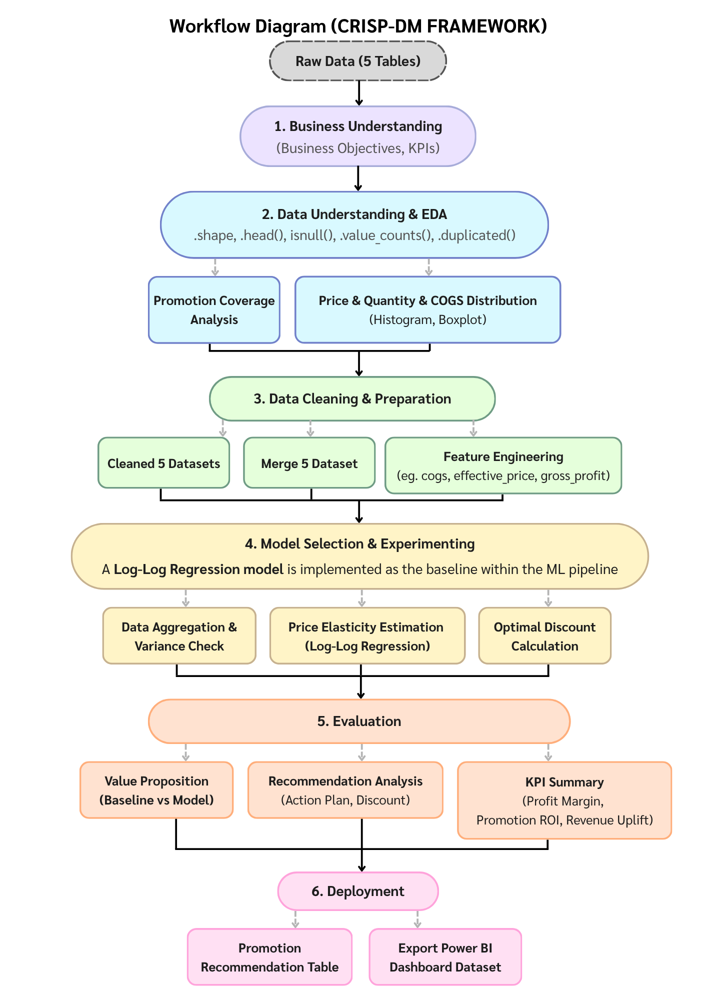
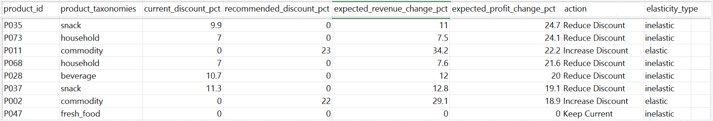

# 📈 Price Elasticity-Based Promotion Optimizer

**BOTNOI Consulting – Data Science Trainee Test**   

**Parinda Lertpituckchaiporn (Dear)**

---

## 🎯 Business Problem & Objective

ธุรกิจค้าปลีก (Retail) โดยเฉพาะกลุ่ม SME ในไทยกำลังเผชิญกับการแข่งขันด้านราคาที่รุนแรง ต้นทุนที่สูงขึ้น และสินค้าราคาถูกจากคู่แข่งในตลาด

หลายธุรกิจเลือกใช้การจัด Promotion เพื่อกระตุ้นยอดขาย แต่การทำ Promotion แบบเดาสุ่มไม่มีข้อมูลรองรับส่งผลให้
* กำไร (Profit Margin) ลดลงโดยไม่จำเป็น
* ใช้งบประมาณโปรโมชั่นอย่างไม่มีประสิทธิภาพ
* พลาดโอกาสในการเพิ่มยอดขายของสินค้าที่ตอบสนองต่อราคาได้ดี

ตัวอย่างเช่น
* สินค้าบางรายการลดราคา 20% แต่ยอดขายแทบไม่เพิ่มขึ้น
* สินค้าบางรายการลดราคาเพียง 5% ก็สามารถเพิ่มยอดขายได้อย่างมาก

ดังนั้นคำถามสำคัญคือ
> "ควรลดราคาสินค้าแต่ละตัวเท่าไร จึงจะสร้างกำไรสูงสุดให้กับธุรกิจ"

---

# 💡 Solution
**Price Elasticity-Based Promotion Optimizer**
ระบบวิเคราะห์ความไวของลูกค้าต่อการเปลี่ยนแปลงราคา (Price Elasticity of Demand) ของสินค้าแต่ละรายการ และคำนวณส่วนลดที่เหมาะสมที่สุด เพื่อเพิ่มประสิทธิภาพของการจัด Promotion

---

# 📂 Dataset

| Dataset | รายละเอียด | Rows | Columns |
|----------|------------|------:|--------:|
| sales_transaction | ข้อมูลธุรกรรมการขาย | 5,050 | 8 |
| product_master | ข้อมูลสินค้าและต้นทุน | 88 | 4 |
| promotion_master | ข้อมูล Promotion และส่วนลด | 40 | 5 |
| customer_master | ข้อมูลกลุ่มลูกค้า | 515 | 2 |
| store_master | ข้อมูลประเภทสาขา | 20 | 2 |

---
# 🔄 Project Workflow

พัฒนาตาม **CRISP-DM Framework**

**Business Understanding → Data Preparation → Modeling → Evaluation → Deployment**

  

---

# 🧹 Data Preparation
ทำ Data Cleaning และ Feature Engineering เพื่อเตรียมข้อมูลสำหรับการวิเคราะห์ โดยแก้ไขปัญหา
* Missing Values
* Duplicate Records
* Data Inconsistency
* Outliers

พร้อมสร้างตัวแปรสำคัญ เช่น
* Revenue
* Effective Price
* Gross Profit
* Profit Margin
* Discount Rate

---

# 📈 Price Elasticity Estimation
ใช้ **Log-Log Regression** เพื่อประมาณค่า Price Elasticity ของสินค้าแต่ละรายการ
ผลลัพธ์จากสินค้า 80 รายการ
| ประเภท    | จำนวน |
| --------- | ----: |
| Elastic   |    27 |
| Inelastic |    53 |

---

# 🎯 Promotion Optimization
จำลองส่วนลดตั้งแต่ **0–40%** เพื่อค้นหาส่วนลดที่สร้างกำไรสูงสุดของแต่ละสินค้า
ผลลัพธ์ที่ได้

| Action            | จำนวนสินค้า |
| ----------------- | ----------: |
| Reduce Discount   |          49 |
| Keep Current      |          20 |
| Increase Discount |          11 |

---

# 📊 KPI
1. Profit Margin : วัดว่าสามารถเพิ่มยอดขายได้โดยไม่ทำลายกำไร และรักษา Margin ให้อยู่ในระดับที่เหมาะสม
2. Promotion ROI : วัดความคุ้มค่าของการลงทุนด้าน Promotion ว่าสร้างผลตอบแทนกลับมามากมั้ย
3. Revenue Uplift : เพื่อวัดว่าคำแนะนำด้าน Promotion ช่วยเพิ่มรายได้จากการขายได้มากน้อยเพียงใดเมื่อเทียบกับแนวทางเดิม

**KPI  Results**
| KPI            | Historical | Optimized |
| -------------- | ---------: | --------: |
| Profit Margin  |      19.1% |     46.4% |
| Promotion ROI  |      71.3% |    249.8% |
| Revenue Uplift |     +23.1% |    +23.6% |

---

# 📦 Final Output
* `promotion_recommendation.csv` — คำแนะนำส่วนลดที่เหมาะสมสำหรับแต่ละสินค้า

  
* `powerbi_dashboard_data.csv` — Dataset สำหรับสร้าง Power BI Dashboard
